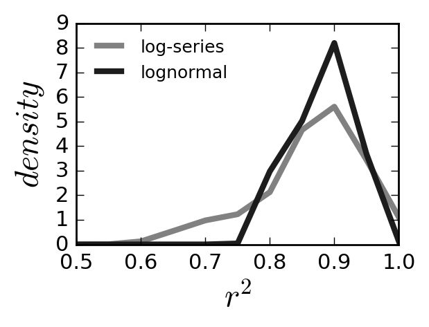
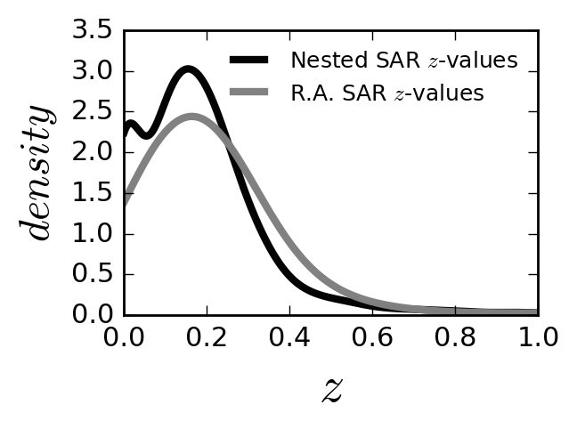
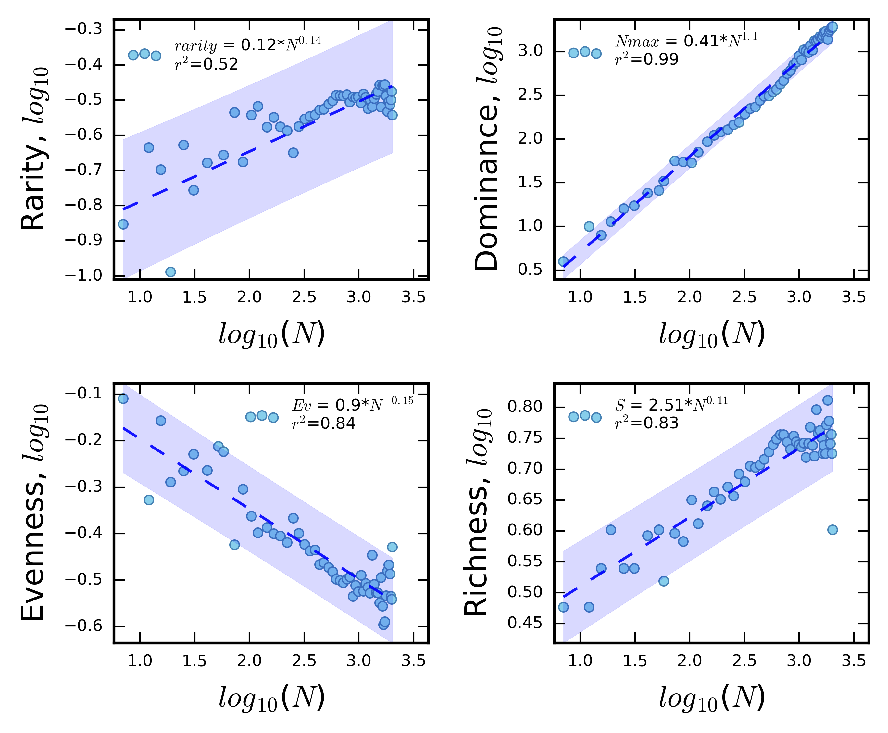

## Emergence: A platform for modeling the simultaneous emergence of ecological patterns

Kenneth J. Locey, Jay. T. Lennon

Affiliations:
Department of Biology, Indiana University, Bloomington, IN, 47405, USA.  
Correspondence to: ken@weecology.org; lennonj@indiana.edu.

## Abstract
Patterns underpin ecological theories and paradigms.
While over a dozen ecological patterns are considered to be classic or even law-like, most are divided among non-overlapping theories and subfields.
As a result, ecology lacks a holistic understanding for how primary patterns can emerge in unison.
We developed a simulation-based platform for this purpose.
The *Emergence* platform encodes energetic costs, ecological selection, stochasticity, and multiplicative interactions.
These phenomena capture the basis of life history trade-offs, resource-limited growth, the importance of stochasticity and determinism, and the nonlinear nature of ecological dynamics.
*Emergence* builds individual-based models from random starting conditions and allows ecological selection to operate on random variation in species traits.
*Emergence* generates established patterns of commonness and rarity, scaling patterns from metabolic theory and biodiversity theory, growth and abundance patterns of population ecology, and trade-offs in life history strategies.
Our platform reveals that iconic ecological patterns that span paradigms, theories, and subdisciplines can simultaneously emerge from random starting conditions when basic principles are observed.

## Introduction
The foundations of ecology are built on the discovery, explanation, and prediction of relationships between organisms and their environment, i.e., ecological patterns (MacArthur 1972, Lawton 1996).
Such patterns have inspired ecological paradigms for over a century and are the signatures of ecological mechanisms (Table 1).
Some ecological patterns have been documented since the time of Darwin's publications (e.g., Watson 1859) or even earlier (e.g., Malthus 1798).
To this day, ecologists seek unified theories for the common explanation of patterns (e.g., Hubbell 2001, McGill 2010, Harte 2011) and continue to uncover patterns using increasingly large and diverse datasets (e.g., Locey and Lennon 2016).
However, the many common patterns of ecology are largely studied in isolation, divided among subdisciplines and theories with little overlap.

Given enough time and resources, an army of ecologists could document many commonly studied patterns in an environment of sufficient diversity and space.
Physiological ecologists and macroecologists could document the many allometric relationships of metabolic theory (Brown et al. 2004). 
Population ecologists could reveal patterns of growth while life historians could measure trade-offs in reproductive strategies (Begon et al. 2009).
Community ecologists and biodiversity scientists could test their many models and theories of biodiversity against empirical patterns of commonness and rarity (McGill 2010).
Ecologists that specialize on particular taxa (e.g., microbial ecologists, mammalogists, plant ecologists) or different scales (e.g., molecular ecologists, macroecologists) could document these and many other patterns in their respective systems.
Yet despite their united effort, this army of ecologists would likely splinter when analyzing their patterns with theory and models.

Most ecological models only generate one pattern and few ecological theories make more than one or two predictions (McGill et al. 2007).
Even within the same subfield, different theories can have little-to-no overlap.
For example, metabolic theory of ecology (MTE) and the maximum entropy of theory of ecology (METE) are both macroecological theories.
MTE predicts scaling patterns related to body size, the most powerful of which is the 3/4 scaling of metabolic rate (Brown *et al.* 2004).
However, MTE does not predict patterns of commonness and rarity such as the species abundance distribution (SAD) and species-area relationship (SAR).
In contrast, METE predicts several patterns of commonness and rarity, including the SAD and SAR (Harte 2011).
However, METE makes no predictions of metabolic scaling.
Despite their shared subfield and generality, METE and MTE do not make predictions about any of the same patterns and use few, if any, of the same inputs.
Specifically, while METE uses species richness, total community abundance, and area as primary inputs, MTE uses body size and average temperature.
Beyond a single subdiscipline, the disconnect among theories and paradigms only amplifies when considering the fundamental patterns across the field of ecology.

Ecologists have rarely considered how patterns from across subdisciplines, paradigms, and theories can simultaneously emerge.
This is perhaps due to the difficulties of empirical study and the challenges of deriving elegant models that are capable of producing multiple patterns.
However, one form of ecological modeling is amenable to this task, i.e., individual-based modeling (IBM).
IBMs encode rules of how individual particles (e.g., organisms, resource particles) behave according to theories, principles, mechanisms, and processes (e.g., Rosindell et al. 2015, Hellweger *et al.* 2016).
IBMs can allow population- to ecosystem-level dynamics to emerge over time and space, and can provide degrees of ecological realism, individual variability, and spatial complexity that are untenable with other modeling approaches (Grimm and Railsback 2005).
IBMs can also allow realistic and unanticipated patterns and dynamics to emerge from otherwise simple individual-level interactions and multiple dimensions of ecological complexity (e.g., Locey *et al.* 2017).
Finally, IBMs allow researchers to track, record, and analyze an immense amount of information.

Here, we leverage the power of ecological IBMs with a relatively simple platform that encodes the first principles of several ecological theories.
This platform, called *Emergence*, allows the user to run thousands of IBMs to study the simultaneous emergence of iconic ecological patterns. 
Below, we provide a detailed explanation of how *Emergence* works, the data it quantifies and tracks, the theories and principles that *Emergence* integrates, and the analyses and tests that can be conducted using the *Emergence* source code.

## Methods

### Platform description
Here, we describe *Emergence* largely according to the ODD protocol (Overview, Design concepts, Details), which is standard for describing IBMs (Grimm et al. 2006). 
Unlike most ecological IBMs, which are used to simulate specific systems (DeAngelis and Gross 1992, Grimm and Railsback 2005), *Emergence* is a distributed software platform for running unlimited numbers of IBMs and for studying the simultaneous emergence of ecological patterns from across subdisciplines and theories.
A detailed description of *Emergence*'s source files, functions, and analysis code can be found on the public GitHub source code and data repository (https://github.com/LennonLab/Emergence).
The *Emergence* software can also be downloaded and installed from the Python Package Index: https://pypi.python.org/pypi/Emergence.

### Purpose
*Emergence* is intended to allow the user to study how patterns from multiple ecological theories, subdisciplines, and paradigms can simultaneously emerge.
These paradigms include metabolic scaling and physiological ecology, community ecology and biogeography, life history, neutral theory, resource limitation, and population ecology.
*Emergence* accomplishes three proximate objectives.
First, *Emergence* assembles and runs IBMs from random combinations of system variables and species traits.
Second, *Emergence* stores the outputs of IBMs including animations. 
Third, *Emergence* provides python code for analyzing simulation data.

### Entities & their state variables
**Individual organisms** -- *Emergence* simulates life history processes of growth, dispersal, reproduction, and basal respiration at the individual level. 
Individuals are distinguished by collections of elements within dictionaries, i.e., data objects that hold key-value pairs. 
For example, the dictionary holding information on individual organisms is structured as follows:

	iDict = {'ind1' : 'sp' = 0, 
					  'x'  = 1.2, 
					  'y'  = 3.5, 
					  'sz' = 813.2, 
					  'q'  = 1, 
					  'st' = 'a'; 
			 'ind2' : ...}

where 'ind1' is the key and the variables following the colon are the values for the species ID, x-coordinate, y-coordinate, body size, amount of endogenous resources, and metabolic state (active or dormant).
Individuals undergo changes when randomly sampled from the dictionary.

**Species** -- Each species is characterized by the individuals that share a common set of traits, such as maximum growth rate, metabolic maintenance cost. 
Species information is stored in dictionaries, again as key-value pairs. 

	spDict = {'1' : 'gr' = 0.8, 
					'di'  = 0.5, 
					'rp'  = 0.3, 
					'mt' = 0.2, 
					'mf'  = 0.1, 
					'ef' = [0.1, 0.2, 0.3]; 
			  '2' : ...}

where the species with ID of '1' has an intrinsic growth rate of 0.8, an active dispersal rate of 0.5, a 0.3 probability of randomly resuscitating from a metabolically dormant state, a basal mass specific metabolic rate of 0.2, and resource specific use efficiencies of 0.1, 0.2, and 0.3.

When sampling individuals, the information about their species is gained by accessing the species dictionary.

**Resource particles** -- *Emergence* simulates the movement and consumption of individual resource particles. These particles can vary over several orders of magnitude in size and belong to three resource types. As with individual organisms and species, information about individual resource particles is stored in dictionaries.  

	rDict = {'1' : t = 1, 
				   'v'  = 0.5, 
				   'x'  = 0.3, 
				   'y' = 0.2, 
			 '2' : ...}
	
where 't' is the resource type, 'v' is the size of the particle, and 'x' and 'y' are the x and y coordinates.

### System level state variables
Each *Emergence* model begins with random choices for the values of:

* Width, in arbitrary units
* Height, in arbitrary units
* Flow through rate in units of distance moved per time step by the environmental matrix; a minimum of 0.

### Spatial and temporal scales
**Spatial extent** -- The environment of *Emergence* is square and two dimensional, and can vary along each axis from 1 to any number of arbitrary units. 
All particles move in decimal units, the limit of which is determined by Python's decimal precision. 
This means that individual particles can occupy practically infinite locations.

**Temporal extent** -- *Emergence* models can run for any number of discrete time steps and record data at any number of time steps.

### Process overview and scheduling
**Model assembly** -- The *Emergence* user runs the main python program (i.e., main.py). 
The main program chooses random values for system-level state variables including whether disturbance, immigration, speciation, etc. will occur and at what rates.
The main program also imports modules (i.e., groups of functions) for diversity metrics, spatial analysis, the initiation of output files, and for simulating life history processes (immigration, maintenance, death, growth, consumption, disturbance, passive dispersal, active dispersal, resource flow, resource inflow, and metabolic state transitions).

**Simulating life history** -- *Emergence* models begin simulation immediately after assembly. 
The order of life history processes is randomized at each time step to prevent scheduling bias.
The simulation of the following life history processes can be modified in the 'bide.py' file.

*Immigration:* By default, individuals enter at any point in the environment.
This can can be adjusted in the 'bide.py' file.
Species identities of inflowing propagules are chosen at random from a uniform distribution rather than an ecologically realistic source pool (e.g., log-series or lognormal distribution).
The reason for this is two-fold.
First, pulling immigrants from a uniform distribution maximizes the starting diversity of each model.
Second, beginning with a uniform distribution allows realistic distributions of species abundances to emerge, rather than enforcing them.

*Dispersal:* Active dispersal: Individuals can actively move against a force of flow, at random, or in specified directions.
Preferences for particular modes of active dispersal can be specifed or modified in the 'active_dispersal.py' file. 
Passive dispersal: Individuals can be moved passively (e.g., as planktonic organisms) through the system at rates determined by the environmental rate of flow.

*Consumption:* Sampled individuals increase their levels of endogenous resources by feeding on resource particles.
These endogenous resources can be used to add structural biomass and to pay the energetic costs of life history processes. 
Individuals consume resources according to their species-specific consumption rates for three resource types.
The number of simulated resource types can be changed in the source code files (bide.py, resource_inflow.py). 

*Growth:* Sampled individuals grow in size by integrating endogenous resources as structural biomass.
Individuals grow according to species-specific rates of growth ranging between 0.1% and 100% increase in size per time step.
Individuals' endogenous resources are decreased in direct proportion to their growth.

*Reproduction:* Individuals reproduce clonally, similar to that of many ecological IBMs and models (e.g., Hubbell 2001, Tilman 2004, Rosindell et al. 2015).
Reproduction occurs with a probability determined by individuals' endogenous resources. 
The endogenous resources of the mother individual is evenly divided between two daughters. 
Unless in the case of speciation, the daughters are given a unique individual ID and the species ID of the mother.

*Speciation:* Speciation is simulated within *Emergence* as a discrete event, similar to models of ecological neutral theory (e.g., Hubbell 2001), i.e., where clonal reproduction produces a new species.
However, speciation in *Emergence* is accompanied by mutations in the values of one or more species traits. 
This approach allows for diversity to arise within the system, which the environment can then select on.

*Death:* Individuals sampled at random will die if their levels of endogenous resources or ability to draw resources from structural biomass falls below the minimum metabolic requirements.
Dead individuals are removed from the system, i.e., scavenging and recycling ~~do~~ are not currently ~~occur~~ implemented in *Emergence*.

*Emigration:* Individuals are considered to have emigrated when they pass beyond edges of the environment.
That is, individuals do not reenter.

**Simulating resource processes**

*Supply/inflow:* Resource particles can be allowed to enter at any point in the environment, which can be adjusted in the 'bide.py' file.
The size and type of each inflowing resource particle is chosen at random from a uniform distribution, and can be modified in the same 'bide.py' file.

*Resource dispersal:* Resource particles can be moved passively through the system at rates determined by the rate of flow.
Resource dispersal can be turned off in the 'main.py' file.

*Resource depletion:* Resource particles are depleted through consumption, which can be partial or complete.

### Design concepts

**Basic principles** 
*Ecological selection on random variation:* *Emergence* operates according to a basic principle of evolution, i.e., natural selection on random variation.
*Emergence* assembles models from random combinations of system-level, species-level, and individual-level variables.
*Emergence* then allows the environmental characteristics (e.g., flow rate, resource supply, spatial extent) to select on these random trait combinations.

*Energy-limited life history:* *Emergence* imposes energetic costs to growth and activity.
These energetic costs are directly proportional to life history parameters.
For example, the energetic cost of dispersal is the product of dispersal rate and dispersal distance.
This intuitively means that the energetic cost of dispersal is multiplied (or compounded) across distance such that moving a distance of $x$ in a specific direction requires half the energy as moving a distance of 2$x$ in the same direction.
In the same way, growing at a rate of $x$ is half as costly as growing at a rate of 2$x$.

*Lognormal dynamics:* Multiplicative interactions of random variables underpin one of the most successful models of complex systems, i.e., the lognormal (Crow et al. 1988).
The lognormal was introduced to ecologists by Preston (1962) as a description of how abundance varies among species.
The lognormal has been one of the two most successful models of species abundance for macroscopic plants and animals, and was recently used to form a macroecological theory of microbial diversity (Shoemaker et al. 2017).
By "multiplicative interactions" one simply means that two or more variables interact in a multiplicative or synergistic way.
Such interactions are common in ecology and include population growth and energetic costs multiplied across distance and time (Putnam 1993).
By "random variables" one simply means two independent processes or constraints with degrees of stochastic change.
*Emergence* explicitly simulates lognormal dynamics. 
For example, energetic costs are multiplied across dispersal distance and magnitudes of growth and the frequency of transition between metabolic states. 
These energetic costs are determined by the values of randomly chosen species traits (i.e., random variables).

*Simultaneous emergence:* A popular advantage of IBMs is the potential to study the emergence of complex patterns from the individual level.
*Emergence* is aimed at allowing emergence in three ways that IBMs are rarely employed.
First, *Emergence* allows patterns to emerge from random combinations of traits and state variables.
This allows realistic trait syndromes and patterns to emerge without being forced.
Second, *Emergence* allows orders of magnitude in random variation of starting conditions and species traits.
The degree of variation can be changed in the 'immigration' function located in the 'bide.py' file.
This highly unconstrained approach allows the user of *Emergence* to explore a broad spectrum of trait combinations and ecological solutions.
Third, *Emergence* allows for the study of simultaneous emergence across a practically unlimited number of IBMs.
In this way, *Emergence* initiates with unrealistic ecological communities and unrealistic combinations of species traits, and then allows for realism to develop over time in response to environmental conditions and according to energetic costs.
This approach allows the user of *Emergence* to avoid one of the greatest challenges to ecological modeling, i.e., the circularity of documenting outcomes that are otherwise forced to occur or are excluded from occurring.
The code made available for the analysis of *Emergence* data is intended to examine the variation and central limiting behavior of ecological patterns among thousands of models.

**Other design concepts of the ODD protocol**
*Hypotheses:* These are entirely up to the user to formulate and test according to the capabilities and tools of *Emergence* source code.

*Learning:* Currently, there is no aspect of individual-based learning in Emergence.

*Prediction:* Individuals in *Emergence* do not presently have the ability to anticipate conditions.

*Sensing:* Individuals can sense and move towards resource particles.

*Interaction:* Individuals interact through excluding each other from resources, i.e., preemption. 
There is no explicit communication and because there is presently no trophic structure, there are no trophic interactions.

*Observation:* An unlimited number of *Emergence* models can be run to examine trends and variation in ecological patterns.

### Output data
*Emergence* generates three files of output data. 
Each *Emergence* model quantifies and writes output data for every $n^{th}$ time step, where $n$ can be designated by the user. 
The three are:

**SimData.csv**
-- Each column of this file corresponds to a piece of data about the system that was modeled (e.g., flow rate, total abundance, species richness, species turnover, resource supply and diversity, rate of disturbance, etc.).
Most analyses in *Emergence* source code are conducted on the data in this file.
The following is recorded for each *Emergence* model and stored in SimData.csv:

* Values of randomly chosen input variables
	* length
	* width
	* flow rate
	* maximum resource particle size
	* maximum number of inflowing resource particles
	* number of inflowing resource types
	* initial community size 
* Total individual abundance ($N$) of the dormant and active fractions of ecological communities
* Species richness ($S$) of the dormant and active fractions of ecological communities
* Mean abundance-weighted specific growth rate for the dormant and active fractions of ecological communities
* Mean abundance-weighted species-specific dispersal rate for the dormant and active fractions of ecological communities
* Mean abundance-weighted species-specific resource consumption rates for the dormant and active fractions of ecological communities
* Mean abundance-weighted species-specific rate of random metabolic state transitions (dormant to active) for the dormant and active fractions of ecological communities
* Mean abundance-weighted species-specific rate of decrease in basal metabolic rate accomplished by transitioning to a dormant state, for the dormant and active fractions of ecological communities
* Species turnover
	* Whittaker's $\beta$ 
* Species evenness
	* Smith and Wilson's evenness, $E_{var}$
	* Simpson's evenness, $E_{1/D}$ 
* Species diversity
	* Shannon's diversity, $H'$ 
	* Simpson's diversity, $D_{1/D}$
* Dominance
	* Absolute, $N_{max}$
	* Relative, $N_{max}/N$
* Productivity of
	* Individuals
	* Biomass

**SAR.csv**
-- A file holding results for species-area relationships (SARs) from *Emergence* models.
SARs quantify the rate at which species are encountered with increasing area of a sample, study, landscape, etc.
The SAR is among the most intensively and long-studied patterns in ecology and is one of two patterns commonly predicted by biodiversity theories (Lomolino 2000, Hubbell 2001, Harte 2011).
The SAR file holds z-values for two types of SARs: SARs based on a nested design and SARs based on the random accumulation of subplots (or quadrats).

**RADs.csv**
-- A file holding rank-abundance distributions (RADs) from *Emergence* models.
Also referred to as species-abundance distributions (SADs), rank-abundance curves (RACs), and Whittaker plots, RADs are vectors of the abundances of species in a community.
Along with the SAR, RADs are one of the most intensively studied and commonly predicted ecological patterns (Hubbell 2001, McGill et al. 2007, Harte 2011).

### Patterns generated by Emergence

*Emergence* includes python code to analyze the simultaneous emergence of ecological patterns.

**Species abundance distribution (SAD)**
The SAD is the vector of species abundance in an ecological community and is one of ecology's fundamental patterns of commonness and rarity.
SAD's almost universally reflect that few species in ecological communities are highly abundant while most species are relatively rare (McGill et al. 2007).
The SAD is predicted by more than 20 ecological models, the two most successful of which are the Poisson-lognormal and the log-series distributions (White et al. 2012, Baldridge et al. 2015, Shoemaker et al. 2017).

**Species-area relationship (SAR)**
Also referred to as the species-area curve, the SAR describes the rate at which increasing numbers of species are observed with increasing area, and is also one of ecology's most intensively studied patterns (Rosenzweig 1995, Lomolino 2000).
There four basic types of SARs pertaining to types of biotas and four general sampling schemes (Rosensweig 1995).
Here, we consider SARs for single biotas (i.e., not crossing ecoregions or biogeographical provinces) and generate them using two sampling schemes (i.e., nested design, random aggregation of subplots).

**Metabolic scaling**
The scaling of basal metabolic rate ($B$) with body size ($M$) is one of the strongest patterns of ecology (Brown et al. 2004).
Taking the form $B$ $\propto$ $B_{0}*M^{z}$, the scaling exponent $z$ is most often observed to approach 3/4.
However, this scaling exponent has long been argued to be closer to 2/3 and in some cases can approach 1.0 (Glazier 2006).
The metabolic theory of ecology (MTE) predicts that $z$ = 3/4 and, from this, predicts several other relationships that scale to quarter powers of body size.
These include a -1/4 scaling of mass-specific metabolic rate and a -3/4 scaling of population density.

**Diversity-abundance scaling relationships**
Aspects of species-level diversity have been shown to scale with the total abundance  ($N$) of individuals in a sample at rates that are often similar for microorganisms and macroscopic plants and animals (Locey and Lennon 2016).
These aspects include: 

* Richness ($S$); the number of species in a community.
* Rarity; the concentration of species at low abundances can be quantified as the a measure of the skewness of the histogram of species abundances. 
* Absolute dominance ($N_{max}$); the greatest species abundance.
* Evenness ($E$); the variation in abundance among species and often quantified as a transformation or reflection of the sample variance.

**Taylor's Law**
The variance ($\sigma^2$) in population abundance often scales with the average population abundance ($N/S$) across space and through time at a rate between 1 and 2, i.e., $\sigma^2$ ≈ ($N/S$)$^{1 < z < 2}$.
Named after Taylor (1961), Taylor's Law is observed in many ecological and non-ecological systems.

## Results

**Species abundance distribution (SAD)**
Despite the IBMs being initialized with random samples from uniform distributions, the resulting SADs of *Emergence* are well-fit by the Poisson-lognormal and the log-series distributions (Fig 1).

<figure>

<figcaption>Figure 1. Species abundance distributions for 1,000 IBMs are well-explained by species abundance models. 
Kernel density curves of r-square values for the Poisson lognormal (PLN) distribution and the log-series predicted by the Maximum Entropy Theory of Ecology (METE). 
As commonly observed in ecological communities, both models predicted >75% variation in abundance among species. </figcaption>
</figure>

**Species-area relationship (SAR)**
*Emergence* produced realistic forms of the SAR according to several sampling schemes (Fig 2).

<figure>

<figcaption>Figure 2. Species-area relationships from 1,000 IBMs take realistic forms. 
Kernel density curves of slopes (z-values) of the species-area relationship (SAR) for both two sampling schemes, i.e., nested and random aggregation (R.A.) </figcaption>
</figure>

**Metabolic scaling** 
*Emergence* closely reproduced the 3/4 power scaling of basal metabolic rate to body size, the -1/4 power scaling of mass-specific basal metabolic rate to body size, and the -3/4 scaling of population density to body size (Fig 3).

<figure>

<figcaption>Figure 3. Patterns of metabolic scaling produced by 1,000 Emergence models. 
Each blue data point represent the mean for values across a binned x-axis, to prevent statistical bias due to the large number of data points of intermediate body sizes. 
The dashed blue line is the regression line and the light blue hull is the 95% prediction interval.
</figcaption>
</figure>

**Diversity-abundance relationships** 
*Emergence* closely reproduced diversity-abundance scaling relationships (Fig 4).
The relationships for rarity, dominance, and evenness are close to the overall results from Locey and Lennon (2016).
The relationship of richness to total abundance was similar to that for some microbial and animal datasets analyzed by Locey and Lennon (2016). 

<figure>

<figcaption>Figure 4. Diversity-abundance scaling relationships produced by 1,000 Emergence models are similar to those reported by Locey and Lennon (2016). 
Each blue data point represents the mean for values across a binned x-axis. This prevents statistical bias due to the large number of data points of high total abundance ($N$).
The dashed blue line is the regression line and the light blue hull is the 95% prediction interval.</figcaption>
</figure>

**Taylor's Law**
*Emergence* reproduced Taylor's Law, with the scaling exponent just below 2.0 (Fig 5).

<figure>

<figcaption>Figure 5. 
The population abundance variance-mean relationship from 1,000 Emergence models closely reproduces Taylor's Law.</figcaption>
</figure>

## Discussion

The *Emergence* platform represents a holistic approach to the study and unification of ecological patterns and processes.
*Emergence* allows patterns from different ecological paradigms, theories, and subdisciplines to emerge simultaneously across thousands of individual-based models (IBMs).
These IBMs encode general life history processes, few explicit constraints, and allow several orders of magnitude of variation in species traits and environmental variables.
In doing so, primary patterns of community ecology, macroecology, population ecology, life history, metabolic theory, and biodiversity science emerge from the simulation of first principles: energetic costs, ecological selection, multiplicative interactions, and stochasticity.
*Emergence* is agnostic and inclusive in that it does not place primary importance on any of its encoded principles and is not meant to exclude the future addition of others (e.g., energy budgets, stoichiometry). 
*Emergence* does not place explicit constraints on body size or life history trade-offs.
Instead, we designed *Emergence* to allow all patterns to emerge from randomized conditions in ways that would have been difficult to anticipate from examining the source code.

The simultaneous emergences of ecological patterns via the *Emergence* platform is unprecedented.
Realistically uneven SADs with few dominant species and many rare species, resulted from initial even SADs where almost every individual belonged to a different species.
This starting condition was intended to allow realistic SADs to emerge and also to avoid the circularity whereby theories of biodiversity almost universally begin with the assumption that the SAD is a hollow-curve (McGill 2010).
Additionally, metabolic scaling relationships emerged despite the lack of any explicit constraints on body size and without enforcing any power-law mechanism related to metabolism.
Likewise, realistic species area relationships (SARs) and realistic diversity-abundance scaling relationships emerged despite having no hard constraints on either total abundance or species richness.
Finally, all of these patterns emerged simultaneously.

*Emergence* implicitly unifies major ecological patterns under the importance of life history processes and three general mechanisms: lognormal dynamics (i.e., multiplicative interactions of stochastic variables), energetic constraints, and ecological selection.
To our knowledge, the entire set of patterns produced by *Emergence* have never been predicted by any single ecological theory, nor by any synthesis of theories.
However, many other ecological patterns can also be produced by the *Emergence* platform, as is.
Examples are distance decay relationships, growth curves, spatial abundance distributions, body-size distributions, and species-time relationships.
Furthermore, *Emergence* allows exploration of novel questions and patterns while ensuring realistic ecological structure and dynamics.
For example, one could explore interrelated changes in the SAR and SAD while ensuring that ecological realism in terms of Taylor's Law and metabolic scaling are retained.
One can modify the *Emergence* source code to include any additional number of processes, reproductive modes, etc., while ensuring that ecological realism is maintained in other respects.
With additional modifications *Emergence* should produce countless other ecological patterns or even patterns that transcend biological fields, i.e., by simulating evolutionary processes, landscape dynamics, and by attributing genome sequences to individuals.

*Emergence* can be freely distributed and modified, and will continue growing to give simulated individuals evolvable traits and genomes and to include new ecological dynamics (e.g., predator-prey, mutualism, parasitism) as well as the aspects of strict mass balance and stoichiometry expected with a more explicit accounting of all mass and energy within a system.
Developments to *Emergence* will also include greater spatial complexity (e.g., habitat islands, archipelagos, corridors, etc.).
Because *Emergence* is open source and hosted on a public repository, any interested scientist can either contribute to evolution of the *Emergence* platform or even use our platform as a foundation for their own study in emergence modeling.

## References

* Baldridge E, Harris DJ, Xiao X, White EP. 2016. An extensive comparison of species-abundance distribution models. PeerJ, 4:e2823.
* Begon M, Mortimer M, Thompson DJ. 2009. Population ecology: a unified study of animals and plants. John Wiley & Sons.

* Brown JH, Gillooly JF, Allen AP, Savage VM, West GB. 2004. Toward a metabolic theory of ecology. Ecology, 85:1771-1789.

* Crow EL, K Shimizu. (Eds). 1988. Lognormal distributions: Theory and applications. New York: M. Dekker.

* DeAngelis DL, Gross LJ. 1992. Individual-based models and approaches in ecology. Chapman & Hall.

* Glazier DS. 2006. The 3/4-power law is not universal: evolution of isometric, ontogenetic metabolic scaling in pelagic animals. BioScience, 56:325-332.

* Grimm V, Berger U, Bastiansen F, Eliassen S, Ginot V, Giske J, Goss-Custard J, Grand T, Heinz SK, Huse G, Huth A, Jepsen JU, Jørgensen C, Mooij WM, Müller B, Pe’er G, Piou C, Railsback SF, Robbins AM, Robbins MM, Rossmanith E, Rüger N, Strand E, Souissi S, Stillman RA, Vabø R, Visser U, DeAngelis DL. 2006. A standard protocol for describing individual-based and agent-based models. Ecological modelling, 198:115-126.

* Grimm V, Railsback SF. 2005. Individual-based modeling and ecology (Vol. 2005). Princeton: Princeton university press.

* Grimm, V, Revilla E, Berger U, Jeltsch F, Mooij WM, Railsback SF, Thulke H, Weiner J, Wiegand T, DeAngelis DL. 2005. Pattern-oriented modeling of agent-based complex systems: lessons from ecology. Science, 310:987-991.

* Haegeman B, Loreau M. 2014. General relationships between consumer dispersal, resource dispersal and metacommunity diversity. Ecology letters, 17:175-184.

* Harte J. 2011. Maximum entropy and ecology: a theory of abundance, distribution, and energetics. Oxford University Press.

* Hellweger FL, Clegg RJ, Clark JR, Plugge CM, Kreft J. 2016. Advancing microbial sciences by individual-based modeling. Nature Reviews Microbiology, 14:461-471.

* Hechinger RF, Lafferty KD, Dobson AP, Brown JH, Kuris AM. A common scaling rule for abundance, energetics, and production of parasitic and free-living species. Science 333:445-448.

* Hubbell SP. 2001. The unified neutral theory of biodiversity and biogeography. Princeton University Press.

* Lawton JH. 1996. Patterns in ecology. Oikos, 75:145-147.

* Leibold MA, Holyoak M, Mouquet N, Amarasekare P, Chase JM, Hoopes MF, Holt RD, Shurin JB, Law R, Tilman D, Loreau M, Gonzalez A. 2004. The metacommunity concept: a framework for multi-scale community ecology. Ecology letters, 7:601-613.

* Locey KJ, Fisk MC, Lennon JT. 2017. Microscale Insight into Microbial Seed Banks. Frontiers in Microbiology, 7:2040.

* Locey KJ, Lennon JT. 2016. Scaling laws predict global microbial diversity. Proceedings of the National Academy of Sciences of the United States of America, 113:5970-5975.

* Lomolino MV. 2000. Ecology’s most general, yet protean pattern: The species‐area relationship. Journal of Biogeography, 27:17-26.

* MacArthur RH. 1972. Geographical ecology: patterns in the distribution of species. Princeton University Press. Chicago	
* Magurran AE, McGill BJ. 2011. Biological diversity: Frontiers in measurement and assessment. Oxford University Press.

* Malthus TR. 1798. An Essay on the Principle of Population. Oxford World Classics reprint.

* McGill BJ, Etienne RS, Gray JS, Alonso D, Anderson MJ, Benecha HK, Dornelas M, Enquist BJ, Green JL, He F, Hurlbert AH, Magurran AE, Marquet PA, Maurer BA, Ostling A, Soykan CU, Ugland KI, White EP. 2007. Species abundance distributions: moving beyond single prediction theories to integration within an ecological framework. Ecology letters, 10:995-1015.

* McGill BJ. 2010. Towards a unification of unified theories of biodiversity. Ecology Letters, 13:627-642.	
* Preston FW. 1962. The canonical distribution of commonness and rarity: Part I. Ecology, 43:185-215.

* Putnam R. Community Ecology. 1993. Chapman & Hall, London, United Kingdom.

* Rosenzweig ML. 1995. Species diversity in space and time. Cambridge University Press.

* Rosindell J, Harmon LJ, Etienne RS. 2015. Unifying ecology and macroevolution with individual‐based theory. Ecology letters, 18:472-482.

* Schramski JR, Dell AI, Grady JM, Sibly RM, Brown JH. 2015. Metabolic theory predicts whole-ecosystem properties. Proceedings of the National Academy of Sciences of the United States of America, 112:2617-2622.

* Shoemaker WR, Locey KJ, Lennon JT. 2016. A macroecological theory of microbial biodiversity. PeerJ Preprints, 4:e1450v4

* Smith B, Wilson JB. 1996. A consumer's guide to evenness indices. Oikos, 1996:70-82.

* Taylor LR. 1961. Aggregation, variance and the mean. Nature. 189: 732–735.

* Tilman D. 2004. Niche tradeoffs, neutrality, and community structure: a stochastic theory of resource competition, invasion, and community assembly. Proceedings of the National academy of Sciences of the United States of America, 101:10854-10861.

* Watson HC. 1859. Cybele Britannica, or British plants and their geographical relations. London, Longman & Company.

* West GB, Brown JH, Enquist BJ. 1997. A general model for the origin of allometric scaling laws in biology. Science, 276:122-126.

* West GB, Brown JH, Enquist BJ. 1999. The fourth dimension of life: fractal geometry and allometric scaling of organisms. Science, 284(5420), 1677-1679.

* White CR, Seymour RS. 2003. Mammalian basal metabolic rate is proportional to body mass $^{2/3}$. Proceedings of the National Academy of Sciences, 100:4046-4049.

* White EP, Thibault KM, Xiao X. 2012. Characterizing species abundance distributions across taxa and ecosystems using a simple maximum entropy model. Ecology, 93:1772-1778.

* Zhao J. 2015. A common origin for 3/4- and 2/3-power rules in metabolic scaling. arXiv:1509.08912.