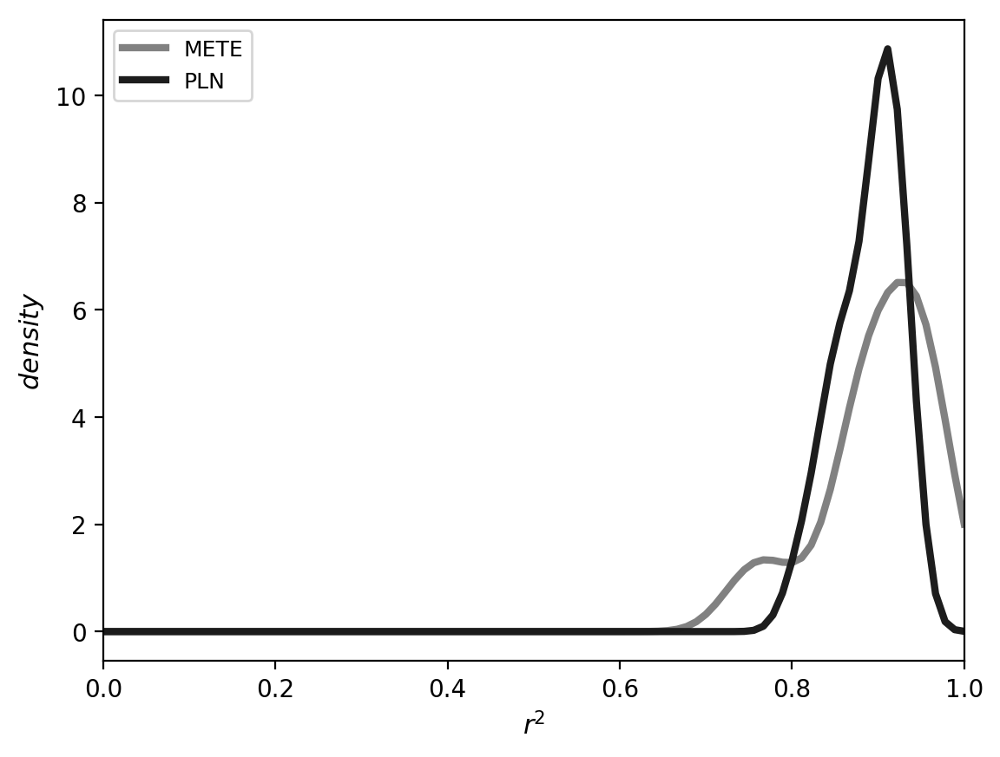
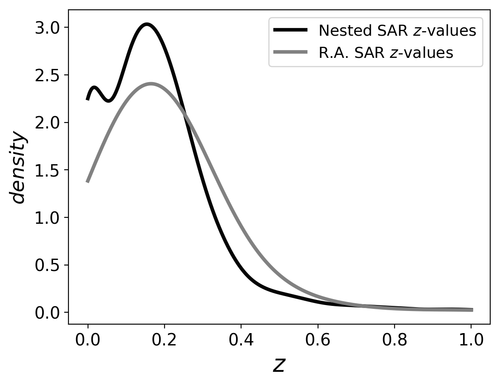
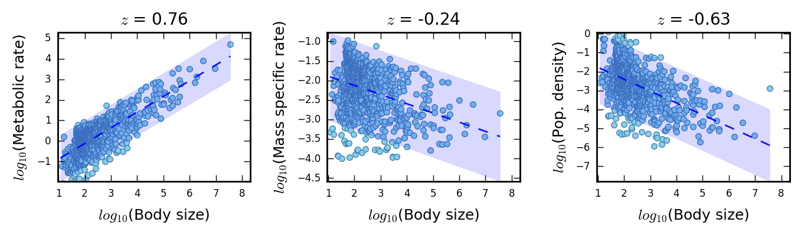
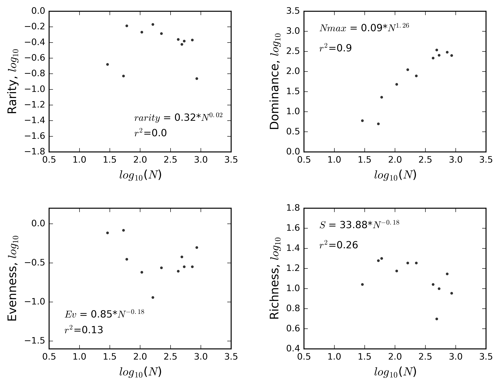
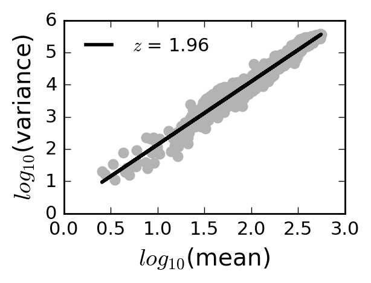

## Simplex: A modeling platform for the simultaneous emergence of ecological patterns across ecological paradigms

#### Kenneth J. Locey, Jay. T. Lennon

### Introduction

Ecology is comprised of subfields that explain and predict patterns of interaction and biodiversity at all scales relevant to living organisms.
From the microscopic scales of microbial ecology to the global scales of macroecology, ecologists study all scales of space and abundance on Earth.
Likewise, from the geological scales of paleoecology to the contemporary scales of urban ecology, ecologists study all scales of time within which taxa evolve.
More than a century of ecological study across these disparate scales has revealed general patterns that have inspired new ecological theories and paradigms.
Given enough time and resources, an army of ecologists could uncover many of these patterns in an environment of sufficient diversity and space.
Yet historically, ecologists have focused little on how patterns that are predicted by different theories and explained by different paradigms, or studied within different subfields can emerge within a single system.

Within a given ecological community, one could test the predictions of any number of ecological theories.
One could test the allometric predictions of metabolic theory, the growth related predictions of resource limitation theory, trade-offs predicted by life history theory, and the many predictions of commonness and rarity from any number of ecological theories of community ecology, macroecology, and biodiversity.
However, the field of ecology has devoted little effort to understanding of how the predictions and patterns from various ecological theories can emerge in the same system.
For example, metabolic theory of ecology (MTE) predicts many scaling patterns related to body size, the most powerful of which is the 3/4 scaling of metabolic rate with body size (Brown *et al.* 2004).
However, MTE does not predict intensively studied patterns of commonness and rarity such as the species abundance distribution (SAD) and species-area relationship (SAR).
Another general ecological theory, the maximum entropy theory of ecology (METE) predicts the SAD, SAR, and several other patterns of commonness and rarity (Harte 2011).
However, despite their generality, METE and MTE do not predict any of the same patterns and use few, if any, of the same variables.

Ecologists have so far, not developed the computational tools to study the predictions of combined ecological theories and the simultaneous emergence of ecological patterns.
However, one form of ecological modeling is amenable to this task, individual-based modeling (IBM).
IBMs encode rules of how individual particles (e.g., organisms, resource particles) behave according to theories, principles, mechanisms, and processes (e.g., Rosindell et al. 2015).
IBMs allow population to ecosystem-level dynamics to emerge over time and space, and 
provide degrees of ecological realism, individual variability, and spatial complexity that are untenable with other modeling approaches (Grimm and Railsback 2005).
IBMs allow realistic and unanticipated patterns and dynamics to emerge from otherwise simple individual-level interactions and multiple dimensions of ecological complexity (e.g., Locey *et al.* 2017).
Finally, IBMs can allow researchers to track, record, and analyze an immense amount of information.
However, ecological IBMs are typically used to examine highly specific questions and often require consider computational complexity (DeAngelis and Gross 1992, Rosindell et al. 2015, Grimm and Raidlsback 2005).

Here, we leverage the power of ecological IBMs with a relatively simple platform that encodes the first principles of several ecological theories.
This platform, called 'Simplex', allows the user to run thousands of IBMs to study the simultaneous emergence of no less than 20 ecological patterns. 
Below, we provide a detailed explanation of how Simplex works, the data it quantifies and tracks, the theories and principles that Simplex integrates, and the analyses and tests that can be conducted using the Simplex source code.

### Methods

#### Platform description
Here, we describe Simplex largely according to the ODD protocol (Overview, Design concepts, Details), which is standard for describing IBMs (Grimm et al. 2006). 
Simplex, however, is not one IBM intended for use with a specific system.
Simplex is distributable software and a platform for simulating unlimited numbers of IBMs and for studying the simultaneous emergence of ecological patterns predicted by multiple theories.
A detailed descriptions of Simplex source files, functions, and analysis code can be found on the public GitHub repository (https://github.com/LennonLab/simplex).

#### Purpose
Simplex is intended to combine aspects of ecological paradigms and allow the user to study how patterns from each of these paradigms can simultaneously emerge.
These paradigms include metabolic scaling, community ecology, life history, neutral theory, resource limitation, and ecological energetics.
Simplex accomplishes three proximate objectives.
First, Simplex assembles and runs IBMs from random combinations of system variables and species traits.
Second, Simplex stores the outputs of IBMs including animations. 
Third, Simplex provides R and python code for analyzing simulation data.

#### Entities & their state variables
**Individual organisms** -- Simplex simulates life history processes of growth, dispersal, reproduction, and basal respiration at the individual level. 
Individuals are distinguished by collections of elements within dictionaries, i.e., data objects that hold key-value pairs. 
For example, the dictionary holding information on individual organisms is structured as follows:

	iDict = {'ind1' : 'sp' = 0, 
					  'x'  = 1.2, 
					  'y'  = 3.5, 
					  'sz' = 813.2, 
					  'q'  = 1, 
					  'st' = 'a'; 
			 'ind2' : ...}

where 'ind1' is the key and the variables following the colon are the values for the species ID, x-coordinate, y-coordinate, body size, amount of endogenous resources, and metabolic state (active or dormant).
Individuals undergo changes when randomly sampled from the dictionary.

**Species** -- Each species is characterized by the individuals that share a common set of traits, such as maximum growth rate, metabolic maintenance cost. 
Species information is stored in dictionaries, again as key-value pairs. 

	spDict = {'1' : 'gr' = 0.8, 
					'di'  = 0.5, 
					'rp'  = 0.3, 
					'mt' = 0.2, 
					'mf'  = 0.1, 
					'ef' = [0.1, 0.2, 0.3]; 
			  '2' : ...}

where the species with ID of '1' has an intrinsic growth rate of 0.8, an active dispersal rate of 0.5, a 0.3 probability of randomly resuscitating from a metabolically dormant state, a basal mass specific metabolic rate of 0.2, and resource specific use efficiencies of 0.1, 0.2, and 0.3.

When sampling individuals, the information about their species is gained by accessing the species dictionary.

**Resource particles** -- Simplex simulates the movement and consumption of individual resource particles. These particles can vary over several orders of magnitude in size and belong to three resource types. As with individual organisms and species, information about individual resource particles is stored in dictionaries.  

	rDict = {'1' : t = 1, 
				   'v'  = 0.5, 
				   'x'  = 0.3, 
				   'y' = 0.2, 
			 '2' : ...}
	
where 't' is the resource type, 'v' is the size of the particle, and 'x' and 'y' are the x and y coordinates.

#### System level state variables
Each Simplex model begins with random choices for the values of:

* width in arbitrary units
* height in arbitrary units
* flow through rate in units of distance moved per time step by the environmental matrix; a minimum of 0.

#### Spatial and temporal scales
**Spatial extent** -- The environment of Simplex is square and two dimensional, and can vary along each axis from 1 to any number of arbitrary units. 
All particles move in decimal units, the limit of which is determined by Python's decimal precision. 
This means that individual particles can occupy practically infinite locations.

**Temporal extent** -- Simplex models can run for any number of time steps and record data at any number of time steps.

#### Process overview and scheduling
**Model assembly** -- The Simplex user runs the main python program (i.e., main.py). 
The main program chooses random values for system-level state variables including whether disturbance, immigration, speciation, fluid dynamics, etc. will occur and at what rates.
The main program also imports modules (i.e., groups of functions) for diversity metrics, spatial analysis, the initiation of output files, and for simulating life history processes (immigration, maintenance, death, growth, consumption, disturbance, passive dispersal, active dispersal, resource flow, resource inflow, and metabolic state transitions).

**Simulating life history** -- Simplex models begin simulation immediately after assembly. 
The order of life history processes is randomized at each time step to prevent scheduling bias.

*Immigration:* By default, individuals enter at any point in the environment.
This can can be adjusted in the 'bide.py' file.
Species identities of inflowing propagules are chosen at random from a uniform distribution rather than an ecologically realistic source pool (e.g., log-series or lognormal distribution).
The reason for this is two-fold.
First, pulling immigrants from a uniform distribution maximizes the starting diversity of each model.
Second, beginning with a uniform distribution allows more realistic distributions of species abundances to emerge.

*Dispersal:* Active dispersal: Individuals can actively move against a force of flow, at random, or in specified directions.
Preferences for particular modes of active dispersal can be specifed or modified in the 'active_dispersal.py' file. 
Passive dispersal: Individuals can be moved passively (e.g., as planktonic organisms) through the system at rates determined by the rate of flow through. or by the combination of flow rate and active dispersal.

*Consumption:* Sampled individuals increase their levels of endogenous resources by feeding on resource particles.
These endogenous resources (a.k.a. cell quotas) can be used to add structural biomass and to pay the energetic costs of life history processes. 
Individual consume resources according to their species specific consumption rates for three resource types.
The number of simulated resource types can be changes in the source code files (consume.py, immigration.py, and resource_inflow.py). 
The simulation of consumption can be modified in the 'consume.py' file.

*Growth:* Sampled individuals grow in size by integrating endogenous resources as structural biomass.
Individuals grow according to species specific rates of growth ranging between 0.1% and 100% increase in size per time step.
Individuals' endogenous resources are decreased in direct proportion.

*Reproduction:* Individuals reproduce clonally with a probability determined by their endogenous resources. 
The endogenous resources of the mother individual is evenly divided between two 
daughter individuals. 
Unless in the case of speciation, the daughters are given a unique individual ID and the species ID of the mother.

*Speciation:* Speciation is simulated within Simplex as a discrete event, i.e., where clonal reproduction produces a new species.
Speciation is accompanied by mutations in the values of one or more species traits. 
This approach allows for diversity to arise within the system, which the environment can then select on.

*Death:* Individuals sampled at random will die if their levels of endogenous resources or ability to draw resources from structural biomass falls below the minimum metabolic requirements.
Dead individuals are removed from the system, i.e., scavenging and recycling do not currently occur in Simplex.

*Emigration:* Individuals are considered to have emigrated when they pass beyond edges of the environment.
That is, individuals do not reenter.

**Simulating resource processes**

*Supply/inflow:* Resource particles can be allowed to enter at any point in the environment, which can be adjusted in the 'bide.py' file.
The size and type of each inflowing resource particle is chosen at random from a uniform distribution, and can be modified in the same 'bide.py' file.

*Resource dispersal:* Resource particles can be moved passively through the system at rates determined by the rate of flow through.
Resource dispersal can be turned off in the 'main.py' file.

*Resource depletion:* Resource particles are depleted through consumption, which can be partial or complete.

#### Design concepts

**Basic principles** 
*Ecological selection on random variation:* Simplex operates according to a basic principle of evolution, i.e., natural selection on random variation.
Simplex assembles models from random combinations of system-level, species-level, and individual-level variables.
Simplex then allows the environmental characteristics (e.g., flow rate, resource supply, spatial extent) to select on these random trait combinations.

*Energy-limited life history:* Simplex imposes energetic costs to growth and activity.
These energetic costs are directly proportional to life history parameters.
For example, the energetic cost of dispersal is the product of dispersal rate and dispersal distance.
This intuitively means that the energetic cost of dispersal is multiplied (or compounded) across distance such that moving a distance of x in a specific direction requires half the energy as moving a distance of 2x in the same direction.
In the same way, growing at a rate of x is half as costly as growing at a rate of 2x.

*Lognormal dynamics:* Multiplicative interactions of random variables underpin one of the most successful models of complex systems, i.e., the lognormal (Crow et al. 1988).
The lognormal was introduced to ecologists by Preston (1962) as a description of how abundance varies among species.
The lognormal has been one of the two most successful models of species abundance for macroscopic plants and animals, and was recently used to form a macroecological theory of microbial diversity (Shoemaker et al. 2017).
By "multiplicative interactions" one simply means that two or more variables interact in a multiplicative or synergistic way.
Such interactions are common in ecology and include population growth and energetic costs multiplied across distance and time (Putnam 1993).
By "random variables" one simply means two independent processes or constraints with degrees of stochastic change.
Simplex explicitly simulates lognormal dynamics. 
For example, energetic costs are multiplied across dispersal distance and magnitudes of growth and the frequency of transition between metabolic states. 
These energetic costs are determined by the values of randomly chosen species traits (i.e., random variables).

*Simultaneous emergence:* A popular advantage of IBMs is the potential to study the emergence of complex patterns from the individual level.
Simplex is aimed at allowing emergence in three ways that IBMs are rarely employed.
First, Simplex allows patterns to emerge from random combinations of traits and state variables.
This allows realistic trait syndromes and patterns to emerge without being forced.
Second, Simplex allows several orders of magnitude in random variation of starting conditions and species traits.
This highly unconstrained approach allows the user of Simplex to explore a broad spectrum of trait combinations and ecological solutions.
Third, Simplex allows for the study of simultaneous emergence across a practically unlimited number of IBMs.
In this way, Simplex initiates with unrealistic ecological communities and unrealistic combinations of species traits, and then allows for realism to develop over time in response to environmental conditions and according to energetic costs.
This approach allows the user of Simplex to avoid one of the greatest challenges to ecological modeling, i.e., the circularity of documenting outcomes that are obviously forced to occur.
The code made available for the analysis of Simplex data is intended to examine the variation and central limiting behavior of ecological patterns among thousands of models.

**Other design concepts**
*Hypotheses:* These are entirely up to the user to formulate and test according to the capabilities and analytical tools of Simplex source code.

*Learning:* Currently, there is no aspect of individual-based learning in Simplex.

*Prediction:* Individuals in simplex do not have the ability to anticipate conditions.

*Sensing:* Individuals can sense and move towards resource particles.

*Interaction:* Individuals interact through excluding each other from resources, i.e., 
preemption. 
There is no explicit communication.

*Observation:* An unlimited number of Simplex models can be run to examine trends and variation in ecological patterns.

## Output data
Simplex generates three files of output data. 
Each Simplex model quantifies and writes output data for every $n^{th}$ time step, where $n$ can be designated by the user. 
The three are:

**SimData.csv**
-- Each column of this file corresponds to a piece of data about the system that was modeled (e.g., flow rate, total abundance, species richness, species turnover, resource supply and diversity, rate of disturbance, etc.).
Most analyses in Simplex source code are conducted on the data in this file.
The following is recorded for each Simplex model and stored in SimData.csv:

* Values of randomly chosen input variables
	* length
	* width
	* flow rate
	* maximum resource particle size
	* maximum number of inflowing resource particles
	* number of inflowing resource types
	* initial community size 
* Total individual abundance ($N$) of the dormant and active fractions of ecological communities
* Species richness ($S$) of the dormant and active fractions of ecological communities
* Mean abundance-weighted specific growth rate for the dormant and active fractions of ecological communities
* Mean abundance-weighted species-specific dispersal rate for the dormant and active fractions of ecological communities
* Mean abundance-weighted species-specific resource consumption rates for the dormant and active fractions of ecological communities
* Mean abundance-weighted species-specific rate of random metabolic state transitions (dormant to active) for the dormant and active fractions of ecological communities
* Mean abundance-weighted species-specific rate of decrease in basal metabolic rate accomplished by transitioning to a dormant state, for the dormant and active fractions of ecological communities
* Species turnover
	* Whittaker's $\beta$ 
* Species evenness
	* Smith and Wilson's evenness, $E_{var}$
	* Simpson's evenness, $E_{1/D}$ 
* Species diversity
	* Shannon's diversity, $H'$ 
	* Simpson's diversity, $D_{1/D}$
* Dominance
	* Absolute, $N_{max}$
	* Relative, $N_{max}/N$
* Productivity of
	* Individuals
	* Biomass

**SAR.csv**
-- A file holding species-area relationships (SARs) from Simplex models.
SARs quantify the rate at which species are encountered with increasing area of a sample, study, landscape, etc.
The SAR is among the most intensively and long-studied patterns in ecology and is one of two patterns commonly predicted by biodiversity theories (Lomolino 2000, Hubbell 2001, Harte 2011).

**RADs.csv**
-- A file holding rank-abundance distributions (RADs) from Simplex models.
Also referred to as species-abundance distributions (SADs), rank-abundance curves (RACs), and Whittaker plots, RADs are vectors of the abundances of species in a community.
Along with the SAR, RADs are one of the most intensively studied and commonly predicted ecological patterns (Hubbell 2001, McGill et al. 2007, Harte 2011).

#### Patterns generated by Simplex

Simplex includes python code to analyze the simultaneous emergence of ecological patterns.

**Species abundance distribution (SAD)**
The SAD is the vector of species abundance in an ecological community and is one of ecology's fundamental patterns of commonness and rarity.
SAD's almost universally reflect that few species in ecological communities are highly abundant while most species are relatively rare (McGill *et al.* 2007).
The SAD is predicted by more than 20 ecological models, the two most successful of which are the Poisson-lognormal and the log-series distributions (White et al. 2012, Baldridge et al. 2015, Shoemaker et al. 2017).

**Species-area relationship (SAR)**
Also referred to as the species-area curve, the SAR describes the rate at which increasing numbers of species are observed with increasing area, and is also one of ecology's most intensively studied patterns (Lomolino 2000, Rosenzweig 2000).
There four basic types of SARs pertaining to types of biotas and four general sampling schemes (Rosensweig 2000).
Here, we consider SARs for single biotas (i.e., not crossing ecoregions or biogeographical provinces) and generate them using two sampling schemes (i.e., nested design, random aggregation of subplots).

**Metabolic scaling**
The scaling of basal metabolic rate ($B$) with body size ($M$) is one of the strongest patterns of ecology (Brown *et al.* 2004).
Taking the form $B$ $\propto$ $B_{0}*M^{z}$, the scaling exponent $z$ is most often observed to approach 3/4.
However, this scaling exponent has long been argued to be closer to 2/3 and in some cases can approach 1.0 (Glazier 2006).
The metabolic theory of ecology (MTE) predicts that $z$ = 3/4 and, from this, predicts several other relationships that scale to quarter powers of body size.
These include a -1/4 scaling of mass-specific metabolic rate and a -3/4 scaling of population density.

**Diversity-abundance scaling relationships**
Aspects of species-level diversity have been shown to scale with the total abundance  ($N$) of individuals in a sample at rates that are often similar for microorganisms and macroscopic plants and animals (Locey and Lennon 2016).
These aspects include: 

* Richness ($S$); the number of species in a community.
* Rarity; the concentration of species at low abundances can be quantified as the a measure of the skewness of the histogram of species abundances. 
* Absolute dominance ($N_{max}$); the greatest species abundance.
* Evenness ($E$); the variation in abundance among species and often quantified as a transformation or reflection of the sample variance.

**Taylor's Law**
The variance ($\sigma^2$) in population abundance often scales with the average population abundance ($N/S$) across space and through time at a rate between 1 and 2, i.e., $\sigma^2$ ≈ ($N/S$)$^{1 < z < 2}$.
Named after Taylor (1961), Taylor's Law is observed in many ecological and non-ecological systems.
In ecology, the scaling exponent of this relationship is sometimes as high as 3 (*ref*).

### Results

**Species abundance distribution (SAD)**
The SADs of Simplex are well-fit by the Poisson-lognormal and the log-series distributions (Fig 1).

<figure>

<figcaption>Figure 1. Species abundance distributions for 1,000 Simplex models are well-explained by species abundance models. 
Kernel density curves of r-square values for the Poisson lognormal (PLN) distribution and the log-series predicted by the Maximum Entropy Theory of Ecology (METE). 
As commonly observed in ecological communities, both models predicted >75% variation in abundance among species. </figcaption>
</figure>

**Species-area relationship (SAR)**
Simplex produced realistic forms of the SAR according to several sampling schemes (Fig 2).

<figure>

<figcaption>Figure 2. Species-area relationships from 1,000 Simplex models take realistic forms. 
Kernel density curves of slopes (z-values) of the species-area relationship (SAR) for both two sampling schemes, i.e., nested and random aggregation (R.A.) </figcaption>
</figure>

**Metabolic scaling** 
Simplex closely reproduced the 3/4 power scaling of basal metabolic rate to body size, the -1/4 power scaling of mass-specific basal metabolic rate to body size, and the -3/4 scaling of population density to body size (Fig 3).

<figure>

<figcaption>Figure 3. Patterns of metabolic scaling produced by 1,000 Simplex models. 
Each blue data point represent the mean for values across a binned x-axis, to prevent statistical bias due to the large number of data points of intermediate body sizes. 
The dashed blue line is the regression line and the light blue hull is the 95% prediction interval.
</figcaption>
</figure>

**Diversity-abundance relationships** 
Simplex closely reproduced diversity-abundance scaling relationships (Fig 4).
The relationships for rarity, dominance, and evenness are close to the overall results from Locey and Lennon (2016).
The relationship of richness to total abundance was similar to that for some microbial and animal datasets analyzed by Locey and Lennon (2016). 

<figure>

<figcaption>Figure 4. Diversity-abundance scaling relationships produced by 1,000 Simplex models are similar to those reported by Locey and Lennon (2016). 
Each blue data point represents the mean for values across a binned x-axis. This prevents statistical bias due to the large number of data points of high total abundance ($N$).
The dashed blue line is the regression line and the light blue hull is the 95% prediction interval.</figcaption>
</figure>

**Taylor's Law**
Simplex reproduced Taylor's Law, with the scaling exponent just below 2.0 (Fig 5).

<figure>

<figcaption>Figure 5. 
The population abundance variance-mean relationship from 1,000 Simplex models closely reproduces Taylor's Law.</figcaption>
</figure>

### Discussion

The Simplex platform combines ecological paradigms and general mechanisms to allow many ecological patterns and relationships to emerge simultaneously. 
In this way, the relatively simple source code of Simplex allows patterns of community ecology, macroecology, and biodiversity science to emerge from individual-level changes and relatively few explicit constraints. 
Simplex assembles individual-based models from random combinations of system-level variables, species traits, and process-related rates. 
This large degree of initially random conditions allows users to explore a large degree of variation in ecological conditions and to avoid the circularity of building overly-informed models. 
In this way, Simplex allows the user to examine the simultaneous emergence of ecological relationships under wide-ranging conditions and combinations of ecological paradigms.

Simplex is designed to explore and test the simultaneous emergence of ecological relationships and other patterns. 
The usefulness of this is manifold. 
First, ecologists often have little knowledge of how ecological patterns are related or either interdependent or even perhaps mutually exclusive. 
Simplex is perhaps ecology's first tool for targeting such questions. The ability to examine simultaneous emergence can also be used to great effect when testing or developing ecological theory. While many  ecological theories predict only one or a few patterns, strong theories should unify and predict multiple patterns (McGill et al. 2007). 
Likewise, strong tests should evaluate the ability of ecological theories to explain and predict multiple patterns (e.g., Xiao et al. 2015).

Simplex has also been designed to combine concepts from several ecological paradigms into a single platform that offers source code that is easy to read, use, and modify. 
By default, Simplex includes the stochastic dynamics inherent to some ecological theories (e.g., neutral theory, stochastic geometry, stochastic resource limitation theory). 
Likewise, Simplex includes the resource-limited growth dynamics of resource limitation theory and chemostat theory, and the inherent species sorting and environmental filtering (i.e., ecological selection) of community ecology. 
Finally, Simplex includes the lognormal dynamics of a recent macroecological theory, i.e., multiplicative interactions of stochastic variables, in addition to energetic constraints that underpin trade-offs of life history theory (e.g., r vs. K selection).

Simplex offers the first individual-based modeling platform for metabolic scaling theory. 
Metabolic scaling predicts that the magnitude of basal metabolic rate ($B$) increases to a fractional power of body mass ($M$), i.e., $B$ = $M^{z}$. 
This relationship is most often observed to follow a 3/4 power scaling, i.e., $z$ = 3/4. 
The 3/4 scaling law has become one of the most universal and highly supported statistical relationships in the biological sciences. 
MTE and many related studies have used this scaling law to predict aspects of metabolic power, population dynamics, community ecology, ecosystem function, and trophic interactions (*refs*). 
The reasoning behind the 3/4 power scaling law rests on fractal branching networks responsible for the delivery of resources to cells and tissues. 
However, scientists still argue whether a 2/3 scaling based on surface area to volume ratios is more accurate and appropriate (*refs*) and even whether a 3/4 and 2/3 scaling can arise from the same mechanism (*refs*).
Finally, some have shown that the scaling of metabolic rate to body size is nearly isometric (0.9 < $z$ < 1) for some taxa (*ref*).

5) LOOKING TO THE FUTURE -- Future developments will include additional ecological dynamcis such as predator-prey, mutualism, and parasitism. 
Improvements to Simplex will also include an accounting of nutrient stoichiometry, and Phosphorus, as well as degrees of biocomplexity. For example, given the chemical structure of phosphate and the size of a resource particle, the particle could be assigned $x$ units of phosphorus as well as the biocomplexity value of phosphate (estimated as a form of Shannon's entropy). 
Likewise, improvements and future versions of Simplex will provide increasing numbers of files for statistical analysis of simulated outputs.

